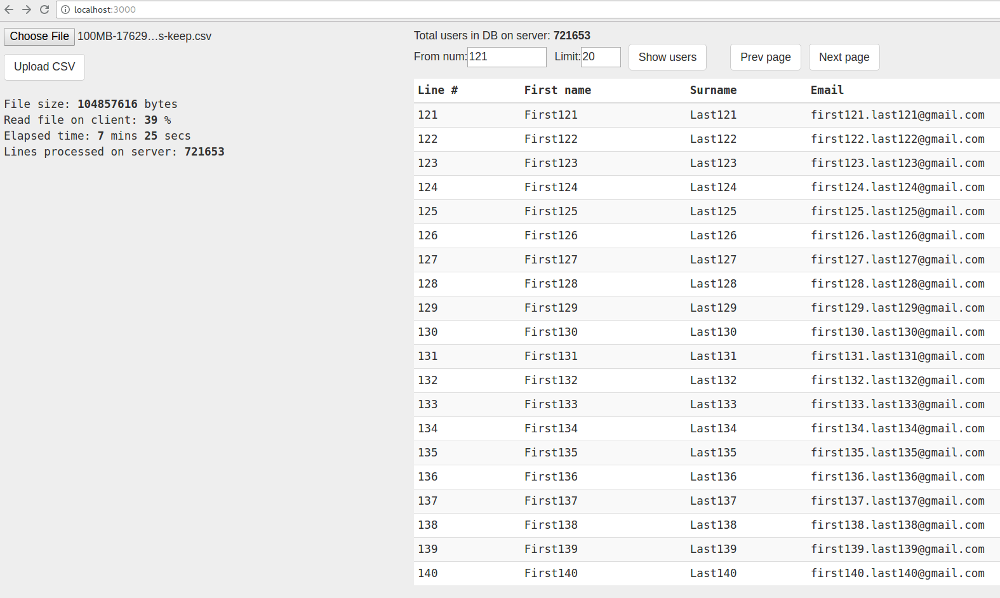

# CSV upload

Client app uses HTML5 `File.slice()` to read CSV file on a client and send bulk of lines to server 
until entire file has been read.



## Storage

On server we use **SQLite3** to store and retrieve saved user records.

App can work with both in-file or in-memory version of SQLite. To change a storage type go to file 
[./db.js](./db.js) and change a block of code in `function createDb(...)`:

```js
} else {
  createDbInFile(onDbCreatedFn); // Inserting users to in file DB is veeeery slooow. About 30 ops/s.
  //createDbInMemory(onDbCreatedFn); // Insert into memory is a way faster.
}
```

## Install

```bash
npm i
```

## Test

```bash
./test.sh
```

## Run a web app

```bash
./prod_build_run.sh
```

Then open in a browser http://localhost:3000

## Generate CSV files?

Need to generate sample CSV files?

### Generate CSV with 20K lines of user data:

```bash
node gen-20K-lines-csv.js
```

### Generate 10MB CSV:

```bash
node gen-10MB-csv.js
```
